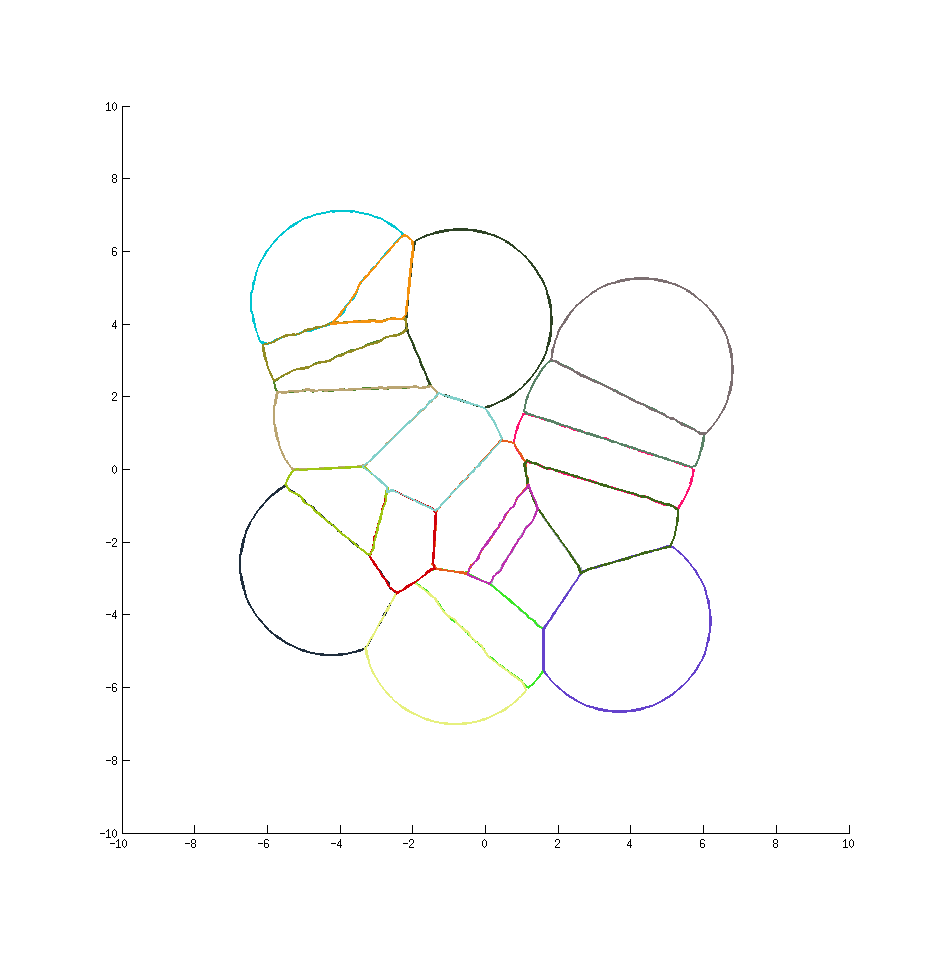

# Crystal Peeks (archivé) 

> Edit 20201127 : ce projet est maintenant archivé. 
> Me contacter si vous souhaitez le réactiver.

Visualisation de la croissance des crystaux de type PEEKS, sur une idée 
originale de X. Tardif avec le logiciel Matlab.



## Programme

### Aide et description du programme

Se placer dans le répertoire du projet. Puis exécutez
```
help crystal_main
help Crystal
```

### Lancement script de test

Se placer dans le répertoire du projet. Puis exécutez 
```
crystal_main.m
```

## License BEERWARE

« LICENCE BEERWARE » (Révision 42):
Sylvain Vandernotte <svandernott@yahoo.fr> a créé ce fichier le 20160408.
Tant que vous conservez cet avertissement,vous pouvez faire ce que vous
voulez de ce truc. Si on se rencontre un jour et que vous pensez que ce
truc vaut le coup, vous pouvez me payer une bière en retour. 
Sylvain Vandernotte 

Note : la license s'applique seulement pour les fichiers suivants : 
- crystal_main
- @Crystal/*

___
Sylvain Vandernotte, 20160408
