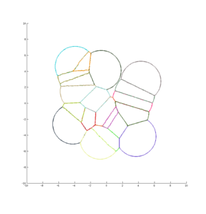

# Crystal Peeks
Visualisation de la croissance des crystaux de type PEEKS, sur une idée 
originale de X. Tardiff avec le logiciel Matlab.

## Lancement

Dans Matlab, se placer dans le répertoire du projet puis executer `crystal_main.m`.

___
Sylvain Vandernotte, 20160408
